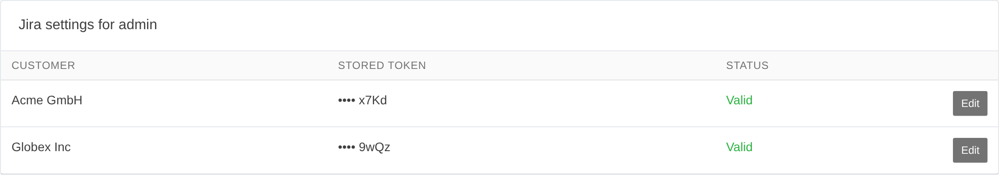

# Einrichtung

## Erste Schritte

1. Als Administrator die Jira-**Server-URL** und den **Auth-Modus** unter **System →
   Einstellungen → Jira** festlegen.
2. Jeder Benutzer öffnet **Jira-Einstellungen** in seinem Benutzermenü und fügt sein eigenes Token
   ein – eine Schaltfläche **Verbindung testen** meldet ein konkretes Ergebnis (abgelehnte
   Zugangsdaten / DNS / TLS / Zeitüberschreitung).
3. Das **Jira-Vorgang**-Feld an einem Zeiteintrag ausfüllen – das Worklog erscheint, sobald der
   Eintrag mit Endzeit gestoppt oder gespeichert wird.


*Jeder Benutzer verwaltet hier sein **eigenes** Token – es wird verschlüsselt gespeichert und nie
zurückgezeigt.*

## Authentifizierung

- **Jira Server / Data Center** – `auth_mode = bearer`; jeder Benutzer fügt einen **persönlichen
  Zugriffstoken** ein (Jira-Profil → Personal Access Tokens).
- **Jira Cloud** – `auth_mode = basic`; jeder Benutzer fügt einen **API-Token** ein
  ([id.atlassian.com](https://id.atlassian.com/manage-profile/security/api-tokens)) und trägt
  seine Jira-Konto-E-Mail in den Kimai-Einstellungen ein (Abschnitt „Jira“).

Die Server-URL ist eine Sicherheitsgrenze – das Token jeder Person wird an den dort angegebenen
Host gesendet – und wird daher **beim Speichern validiert**: Sie muss `https://` verwenden (Token
werden nie im Klartext übertragen) und darf nicht auf eine private, Loopback- oder
Link-local-Adresse zeigen. Eine Änderung lässt beim nächsten täglichen Heartbeat jedes gespeicherte
Token neu validieren, da ein gegen den alten Host geprüftes Token nichts über einen neuen aussagt.

## Cron

Der Abgleich und der (optionale) Importer laufen per Cron – als der Benutzer eintragen, unter dem
Kimais eigene Cron-Jobs laufen:

```bash
# Abgleich: trägt alles nach, was inline nicht synchronisiert werden konnte (alle 5 Minuten)
*/5 * * * * cd /path/to/kimai && bin/console kimai:jira:sync   >> var/log/jira-cron.log 2>&1

# Importer: holt die eigenen Jira-Worklogs jedes Benutzers nach Kimai (Opt-in; z. B. stündlich)
0   * * * * cd /path/to/kimai && bin/console kimai:jira:import  >> var/log/jira-cron.log 2>&1

# Wöchentliche Admin-Zusammenfassung (Montagmorgen)
0 8 * * 1   cd /path/to/kimai && bin/console kimai:jira:sync --digest >> var/log/jira-cron.log 2>&1
```

Damit per Cron versandte E-Mails auf Ihre Instanz verweisen, setzen Sie `framework.router.default_uri`
in Ihrer Kimai-Konfiguration, sodass Links auf Ihre echte Domain statt auf `localhost` zeigen.

## Referenz der Instanz-Einstellungen

Alle instanzweiten Einstellungen finden Sie unter **System → Einstellungen → Jira**. Was jede
einzelne bewirkt, ist in den Anleitungen beschrieben:

- Import-Ziel, projektbezogenes Routing, automatisches Anlegen – [Import](features/importing.md),
  [Projektbezogenes Routing](features/project-routing.md),
  [Automatisches Anlegen](features/auto-create.md).
- Benutzerfeld-Zuordnung – [Benutzerfeld-Übernahme](features/custom-fields.md).
- Benachrichtigungen – [Benachrichtigungen & Sichtbarkeit](features/notifications.md).
