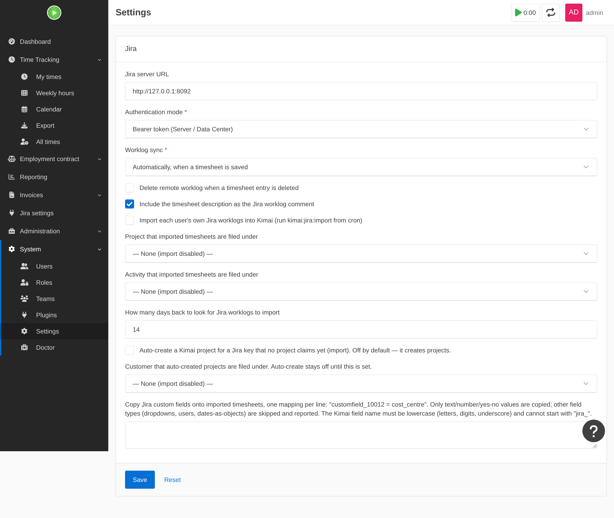

# Importing Jira worklogs (Jira → Kimai)

The reverse direction: developers who log time in Jira can have those worklogs flow into Kimai as
timesheets, instead of double-entering.

## Identity model — own worklogs only

The importer uses each user's **own** stored, encrypted token as their identity
(JQL `worklogAuthor = currentUser()`). No admin/service token, no email-matching — a user only
ever imports worklogs they authored themselves.



## Enable + target

Import is **off by default** (it creates data). Under System → Settings → Jira:

- `jira.import_enabled` = on
- `jira.import_project` / `jira.import_activity` = the **default** target (see
  [per-project routing](project-routing.md) and [auto-create](auto-create.md) for sending
  different Jira projects to different Kimai projects)
- `jira.import_window_days` = how far back to look (default 14)

Run it from its own cron entry, separate from the reconciler:

```bash
0 * * * * cd /path/to/kimai && bin/console kimai:jira:import >> var/log/jira-cron.log 2>&1
```

## Behaviour

- Finds each user's logged issues in the window, imports their own worklogs, and records the Jira
  key, worklog id, and `jira_sync_status=synced` on each timesheet.
- **Deduplicates** against worklog ids Kimai already stores — re-running never duplicates, and it
  never re-imports a worklog Kimai's own outbound sync created.
- **Timezone-correct** — the Jira `started` instant round-trips exactly into the user's timezone.
- **Routes** by Jira key, optionally **auto-creates** projects, and copies mapped
  [custom fields](custom-fields.md).
- `--dry-run` reports without writing; `--user=ID` limits to one user; `--days=N` overrides the
  window.

## Known limitation (MVP)

Imported entries are persisted directly (to avoid a sync feedback loop), which bypasses Kimai's
rate calculators — so they start at **zero/default rates**. Edit an entry, or let your normal rate
rules apply on the next save.

See also: [per-project routing](project-routing.md) · [auto-create](auto-create.md) ·
[custom fields](custom-fields.md).
