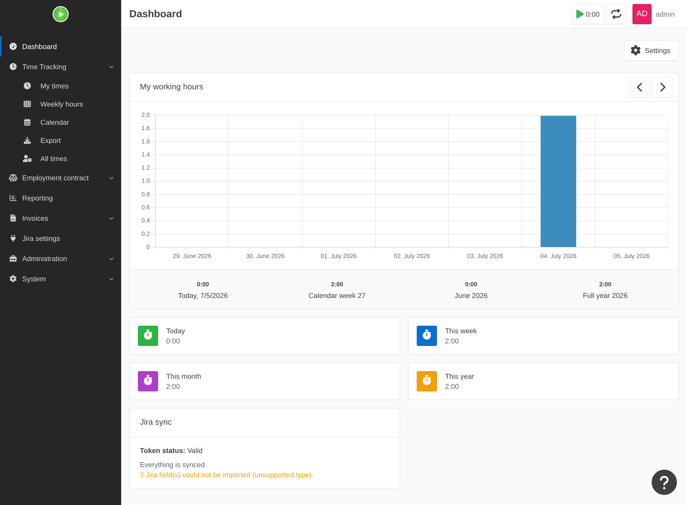

# Benachrichtigungen & Sichtbarkeit

Ein ungültiges Token, eine stockende Synchronisierung oder ein Feld, das der Importer nicht lesen
konnte, darf nie stillschweigend fehlschlagen – „wochenlang fehlende Worklogs, entdeckt zum
Zeitpunkt der Rechnungsstellung“ ist genau das, was diese Schicht verhindert. Alle Kanäle werden
aus den Cron-Jobs gespeist und können weder einen Seitenaufruf noch den Abgleich zum Absturz
bringen (ein defekter Mail-Transport wird protokolliert und verschluckt).

## Token-/Sync-Probleme

- **In-App-Banner** – solange Ihr Token ungültig ist, zeigt der nächste Seitenaufruf einmal pro
  Sitzung eine Warnung (sie erscheint in der nächsten Sitzung erneut, nervt aber nicht auf jeder
  Seite).
- **Eskalations-E-Mail mit Backoff** – wird ein Token von gültig → ungültig, geht sofort eine
  E-Mail heraus, nach 7 Tagen erneut, danach monatlich, solange es ungelöst ist. Derselbe Zeitplan
  greift für einen Benutzer, dessen ältester nicht synchronisierter Eintrag mehr als 7 Tage alt
  ist – auch bei gültigem Token.
- **Dashboard-Widget** – eine „Jira-Sync“-Karte mit Token-Status, Anzahl nicht synchronisierter
  Einträge und dem Alter des ältesten.
- **Wöchentliche Admin-Zusammenfassung** – `bin/console kimai:jira:sync --digest` schickt jedem
  Super-Admin eine einzeilige Zusammenfassung. Aus einem eigenen wöchentlichen Cron-Eintrag
  ausführen.

## Import-Warnungen (Benutzerfelder)

Wenn der Importer ein [Benutzerfeld überspringt](custom-fields.md), das er nicht importieren
konnte, gilt dasselbe Prinzip – die Auslassung wird **gesehen, nicht durchsucht**:

- eine Zeile im **Dashboard-Widget** („N Jira-Felder konnten nicht importiert werden“),
- ein **Admin-Banner** (einmal pro Sitzung, für Benutzer, die die Systemeinstellungen öffnen
  können), mit Verweis auf System → Einstellungen → Jira,
- eine Zeile in der **wöchentlichen Zusammenfassung**,
- und die Ausgabe des Befehls `kimai:jira:import`.

Die Warnungsmenge wird bei jedem Lauf neu geschrieben, sodass das Beheben einer Zuordnung sie beim
nächsten Lauf überall löscht.

## Voraussetzungen

Eskalations-/Zusammenfassungs-E-Mails benötigen ein funktionierendes `MAILER_DSN` und einen
absoluten Link zurück nach Kimai – setzen Sie `framework.router.default_uri` (oder den
Router-Request-Kontext), damit Links in per Cron versandter Mail auf Ihre echte Domain zeigen.
Details siehe [Startseite](../index.md).

Siehe auch: [Worklog-Sync](worklog-sync.md) · [Benutzerfelder](custom-fields.md).
