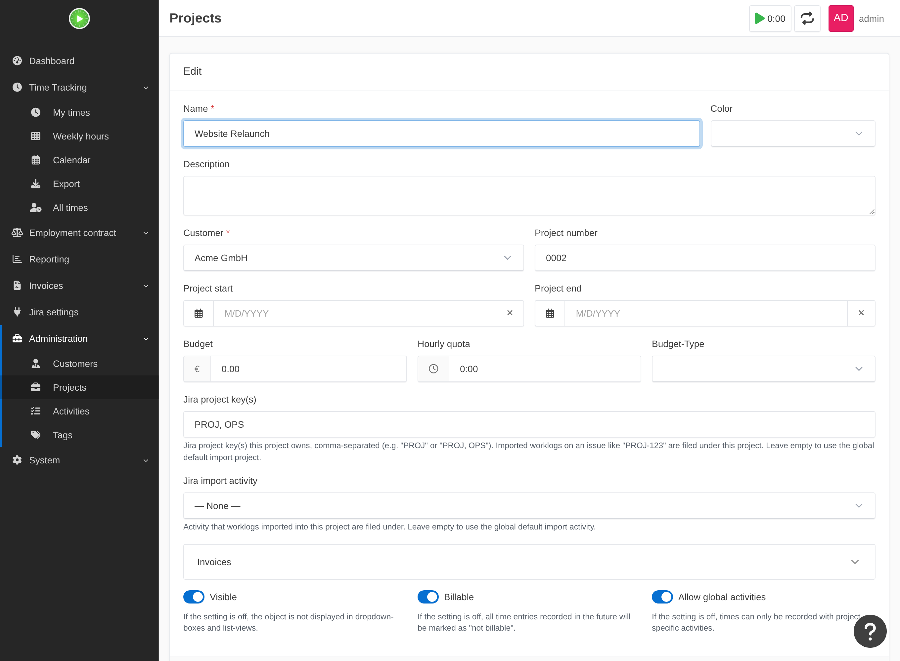

# Projektbezogenes Routing

Standardmäßig legt der Importer jedes importierte Worklog unter einem einzigen Projekt ab
(`jira.import_project`). Das ist falsch, wenn Ihre Jira-Instanz **viele Projekte** hat – dann
soll `PROJ-123` unter das eine Kimai-Projekt und `OPS-9` unter ein anderes. Genau das leistet das
projektbezogene Routing.

## Funktionsweise

Jedes Kimai-Projekt **beansprucht** die Jira-Projektschlüssel, die zu ihm gehören. Öffnen Sie das
normale Bearbeitungsformular eines Projekts (Administration → Projekte → *bearbeiten*) und tragen
Sie ein:

- **Jira-Projektschlüssel** – ein oder mehrere Jira-Schlüssel in Großbuchstaben, kommagetrennt
  (z. B. `PROJ` oder `PROJ, OPS`). Jedes importierte Worklog eines Vorgangs wie `PROJ-123` wird
  unter diesem Projekt abgelegt.
- **Jira-Importtätigkeit** *(optional)* – die Tätigkeit, die importierte Einträge dieses Projekts
  verwenden; sie überschreibt die globale `jira.import_activity`. Leer lassen für den globalen
  Standard.

Die Zuordnung liegt **am Projekt selbst**, wird also mit dem Projekt angelegt und gelöscht – es
gibt keine separate Tabelle oder Seite, die synchron gehalten werden müsste.

!!! tip "Autovervollständigung"
    Mit einem gültigen Jira-Token (aus Ihren **Jira-Einstellungen**) schlägt das Feld
    **Jira-Projektschlüssel** während der Eingabe Ihre Jira-Projekte vor (`KEY — Name`), sodass
    Sie sich die genauen Schlüssel nicht merken müssen. Ohne Token bleibt es ein einfaches
    Textfeld – die Funktion ist reine Komfortfunktion.

## Auflösungsreihenfolge

Für jeden importierten Vorgangsschlüssel wählt der Importer das Ziel in dieser Reihenfolge:

1. **Ein Projekt, das den Schlüssel beansprucht** → dieses Projekt (+ dessen Tätigkeits-Override
   oder die globale Tätigkeit).
2. **Kein Projekt beansprucht ihn** → [automatisches Anlegen](auto-create.md) eines Projekts
   (falls aktiviert), sonst der globale Standard `jira.import_project` / `jira.import_activity`.
3. **Nichts auflösbar** (nicht beanspruchter Schlüssel, kein Standard) → der Vorgang wird
   übersprungen und in der Lauf-Zusammenfassung gezählt, niemals stillschweigend verworfen.

**Abwärtskompatibel:** Beansprucht kein Projekt einen Schlüssel, verwendet jedes Worklog den
globalen Standard – exakt das Verhalten mit einem Ziel wie vor dieser Funktion.

## Hinweise

- Schlüssel werden ohne Beachtung der Groß-/Kleinschreibung verglichen und müssen wie ein
  Jira-Projektschlüssel aussehen (`^[A-Z][A-Z0-9_]*$`); ungültige Einträge werden ignoriert.
- **Doppelte Beanspruchung** – beanspruchen zwei Projekte denselben Schlüssel, gewinnt die
  niedrigere Projekt-ID; der Konflikt wird protokolliert und gezählt, damit Sie ihn erkennen und
  beheben können.
- Ein Schlüssel, dessen Projekt zwischenzeitlich gelöscht/ausgeblendet wurde, fällt in diesem Lauf
  auf den globalen Standard zurück.

Siehe auch: [Import](importing.md) · [Automatisches Anlegen](auto-create.md).
