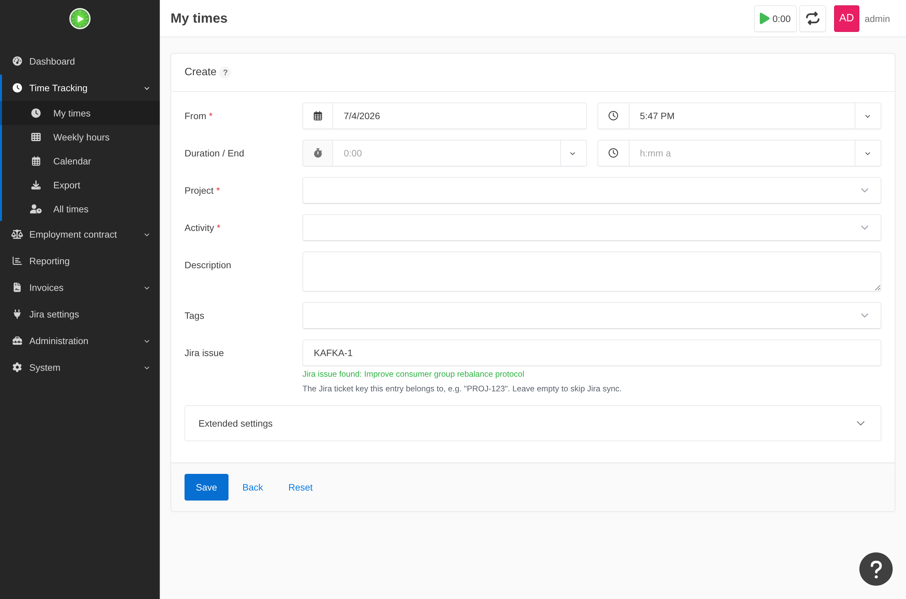

# Kimai Jira Sync

Ein [Kimai](https://www.kimai.org/)-Plugin, das Zeiteinträge mit einem Jira-Vorgangsschlüssel
verknüpft und die erfasste Zeit als Worklog nach Jira überträgt – authentifiziert mit dem
**eigenen** persönlichen Zugriffstoken jedes Benutzers (Jira Server / Data Center) oder API-Token
(Jira Cloud). Die Zeiterfassung funktioniert auch dann weiter, wenn Jira nicht erreichbar ist; die
Synchronisierung holt im Hintergrund auf.

*Das **Jira-Vorgang**-Feld an einem Zeiteintrag – während der Eingabe live geprüft, mit
anklickbarem Link zum Ticket.*

## Was es kann

- Fügt jedem Zeiteintrag ein optionales **Jira-Vorgang**-Feld hinzu (z. B. `PROJ-123`), das
  während der Eingabe live geprüft und als anklickbarer Link zum Ticket angezeigt wird.
- Beim Stoppen/Speichern wird ein **Jira-Worklog erstellt oder aktualisiert** – robust gegenüber
  Jira-Ausfällen, mit einem Hintergrund-Abgleich, der alles nachträgt, was inline nicht
  synchronisiert werden konnte.
- Optional die Gegenrichtung: ein aktivierbarer Import holt die **eigenen Jira-Worklogs jedes
  Benutzers als Zeiteinträge** nach Kimai.
- **Routet** importierte Worklogs anhand ihres Jira-Schlüssels ins richtige Kimai-Projekt, kann
  ein Projekt für einen noch nicht beanspruchten Schlüssel **automatisch anlegen** und übernimmt
  ausgewählte Jira-**Benutzerfelder** auf den Eintrag.
- Ein ungültiges Token, eine stockende Synchronisierung oder ein nicht importierbares Feld bleibt
  **nicht unbemerkt** – ein Sitzungsbanner, Eskalations-E-Mails, ein Dashboard-Widget und eine
  wöchentliche Admin-Zusammenfassung.

Jeder Benutzer speichert seine eigenen Zugangsdaten – ein Token **pro Kunde** – und Token werden
**verschlüsselt gespeichert** und niemals geteilt, protokolliert oder von einer API zurückgegeben.

## In Aktion

**Pro Kunde konfiguriert** – jedes Kunden-Bearbeitungsformular trägt seine eigene Jira-Verbindung,
sein Sync-Verhalten, den aktivierbaren Import, das automatische Anlegen und die Benutzerfeld-
Zuordnung, sodass verschiedene Klienten auf verschiedene Jira-Instanzen zeigen können:

**Importe routen sich selbst nach Jira-Projekt.** Jedes Kimai-Projekt beansprucht auf seinem
Bearbeitungsformular die Jira-Schlüssel, die zu ihm gehören, sodass `PROJ-123` und `OPS-9` unter
verschiedenen Projekten landen ([projektbezogenes Routing](features/project-routing.md),
[automatisches Anlegen](features/auto-create.md)):

**Nichts schlägt stillschweigend fehl.** Ein Jira-Benutzerfeld, das der Importer nicht verarbeiten
kann, wird übersprungen **und angezeigt** – im Dashboard-Widget, in einem Admin-Banner und in der
wöchentlichen Zusammenfassung –, sodass eine fehlende Kostenstelle bei der Rechnungsstellung nie
überrascht ([Benutzerfelder](features/custom-fields.md)):

## Loslegen

- **[Installation](install.md)** – das ZIP nach `var/plugins/` entpacken, den Installer ausführen
  (inkl. Voraussetzungs-Check für Ihr DevOps-Team).
- **[Einrichtung](configure.md)** – kundenbezogene Server-URL, kundenbezogene Token und die
  Cron-Einträge.
- **[Anleitungen](features/worklog-sync.md)** – eine Seite pro Funktion: Worklog-Sync, Import,
  Routing, automatisches Anlegen, Benutzerfelder, Benachrichtigungen und Fehlerbehebung.
